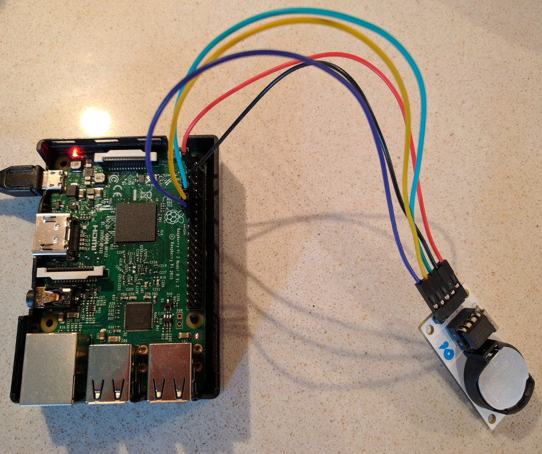

# rpi.rtc
Simple Python module to deal with DS1302 RTC on Raspberry Pi

### Wire map (default conf.)

| Chip        | Rpi pin       |
| ----------- |:-------------:|
| VCC         | 3.3v pin      |
| GND         | GND pin       |
| CLK         | pin 11        |
| DATA        | pin 13        |
| CE (RST)    | pin 15        |

### Setup

    sudo python3 setup.py install
    sudo cp examples/* /usr/local/bin/

### Read RTC chip date and time

    rtc_get_time

### RPi date and time (UTC) to RTC chip

    rtc_set_utc

### Update Rpi system time from RTC chip

Typically call at RPi startup

    sudo update_sys_clock
